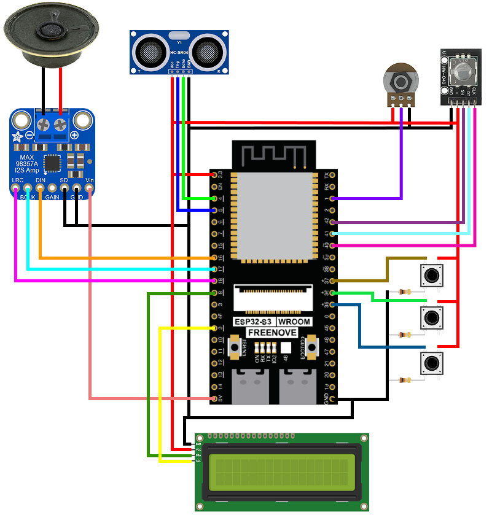

# 간단한 에어 신디사이저 만들기

## 목차
1. [소개](#1-소개)
2. [준비](#2-준비)
3. [회로 구성](#3-회로-구성)
4. [기능 및 사용 방법](#4-기능-및-사용-방법)

## 1. 소개
공중에서 연주가 가능한 간단한 에어 신디사이저

## 2. 준비

### 2.1. 부품 구성
- Freenove ESP32 s3
- 초음파센서 (HC-SR04)
- DAC + 오디오앰프 (MAX98357A)
- 8옴 스피커
- 디스플레이
- 가변저항
- 로터리인코더
- 1kΩ 저항 1개
- 2kΩ 저항 1개
- 220Ω 저항 2개
- LED 2개 (Red, Green 각 1개)
- 점퍼선

### 2.2. 환경 세팅
1. vscode 설치 및 platformIO 설치
2. ESP32 보드 연결
3. 소스코드 다운로드 및 vscode에서 열기
```
git clone (현재 레포지토리의 링크)
```
```
cd Capstone
```
```
code .
```
4. platformIO를 통해서 open project -> Capstone 열기
5. Upload
6. 즐겁게 연주!

## 3. 회로 구성


### 3.1. 초음파센서 HC-SR04
```
HC-SR04 / ESP32 s3
Vcc ----------- 5v
Trig ------ GPIO 5
Echo ------ GPIO 4
GND ---------- GND
```
```
# Echo 핀의 출력은 5v
# 따라서 3.3v 에 가깝게 전압을 분배

Echo --- 1kΩ --- GPIO 5
          |
         2kΩ
          |
         GND
```

### 3.2. 오디오앰프 MAX98357A
```
MAX98357A / ESP32 s3
LRC -------- GPIO 18
BCLK ------- GPIO 17
DIN -------- GPIO 16
GAIN x
SD --(   ?   )-- GND
GND ------------ GND
Vin ------------- 5v
# SD 핀은 연결하지 않거나 플로팅으로 둔다
# 연주하지 않을 때 스피커를 Shut Down 하고 싶다면 SD 핀을 GND에 연결한다
```
```
스피커 / MAX98357A
(+) --------- (+)
(-) --------- (-)
```

### 3.3. LCD
```
LCD / ESP32 s3
GND ------ GND
VCC ----- 3.3v
SDA --- GPIO 1
SCL --- GPIO 2
```

### 3.4. 가변저항
```
가변저항 / ESP32 s3
(1) ---------- GND
(2) ------ GPIO 20
(3) --------- 3.3v
```

### 3.5. 로터리 인코더 HW-040
```
HW-040 / ESP32 s3
CLK ----- GPIO 40
DT ------ GPIO 41
SW ------ GPIO 42
(+) -------- 3.3v
GND --------- GND
```

### 3.6. LED
```
LED(green) --- GPIO 35
LED(red) ----- GPIO 36
```

## 4. 기능 및 사용 방법

### 4.1. 연주
에어 신디사이저를 사용자가 바라보는 왼쪽에 둔다. 이때 초음파 센서가 오른쪽을 바라보게 둔다. 그리고 센서가 감지할 수 있는 영역 안의 공중에 손을 두어 연주한다. 손을 왼쪽으로 움직여 센서에서 가까워질수록 낮은 음이 연주되고, 손을 오른쪽으로 움직여 센서에 멀어질수록 높은 음이 연주된다.

### 4.2. 음량 조절
가변저항으로 음량을 조절한다. 왼쪽으로 돌리면 음량 감소, 오른쪽으로 돌리면 증가.

### 4.3. 음색 변경
로터리 인코더를 통해 음색을 변경한다. 음색 정보는 디스플레이에서 확인할 수 있다.

### 4.4. 블루투스를 이용한 녹음
스마트폰을 이용해 ESP32 보드와 블루투스를 연결한다. 아직 전용 애플리케이션이 없기 때문에 'nRF Connect' 애플리케이션을 이용해 장치를 스캔, 연결, 명령 송신을 수행한다.

- 블루투스 디바이스 명: ESP32_SH
- 녹음 및 중지 명령: Rec (case insensitive)
- 재생 및 정지 명령: Play (case insensitive)

녹음 명령을 내리면 그때부터 연주되는 음을 기록한다. 녹음 명령을 한번 더 내리면 녹음을 중단한다. 재생 명령을 내리면 녹음된 내용을 출력한다. 가장 최근 녹음된 내용이 출력되며, 다시 녹음하게 되면 이전의 기록은 사라진다. 가장 최근에 녹음된 내용이 없으면 아무것도 출력되지 않는다. 재생 도중에 재생 명령을 한번 더 내리면 재생이 중지된다. 녹음 중에는 재생을 할 수 없고, 재생 중에 녹음 명령을 내리면 재생이 중지되고 즉시 새로운 녹음이 시작된다. 해당 기능의 실행 여부는 LED를 통해 확인이 가능하다.

- Built-in LED: 블루투스 장치 연결 여부 표시. 연결 중 on
- LED(red): 녹음 중 on
- LED(green): 재생 중 on